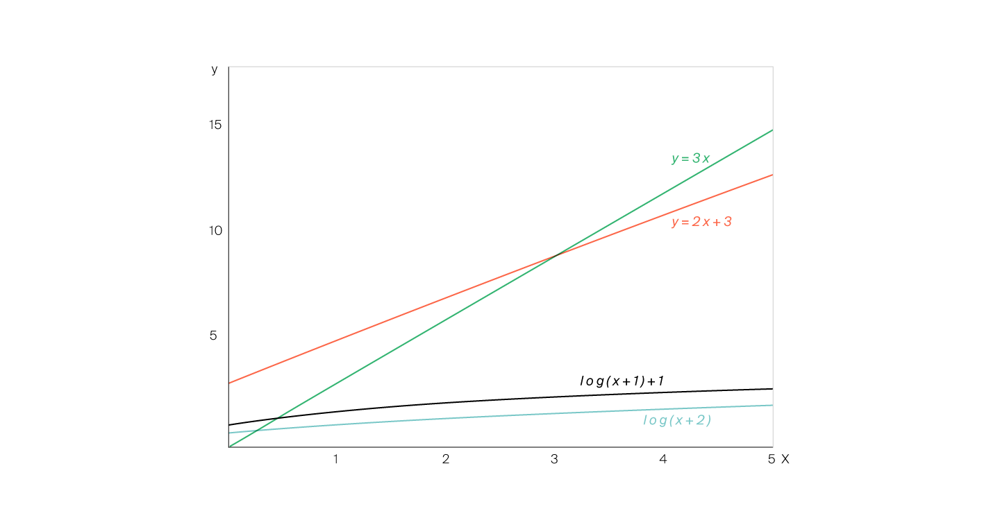

# Сложность алгоритма

Из предыдущих уроков вы узнали, что у разных алгоритмов может быть разное время работы. 

На математическом языке эта идея звучит так: «Вычислительная сложность алгоритма линейно зависит от размера входных 
данных» или «У алгоритма логарифмическая асимптотическая сложность». Но повторять эти фразы каждый раз — утомительно. 
Поэтому придумали сокращения:

* **O(n)** — линейная зависимость;
* **O(log n)** — логарифмическая зависимость.

И говорят так: «Сложность алгоритма — O(n)» (читается «о большое от эн» или просто «о от эн»).
В повседневной жизни также можно услышать фразу, которая означает ровно то же самое: 
«Этот алгоритм работает за O(n)». 

Такие сокращения называются **О-нотацией** (англ. Big O notation).

В О-нотации не учитываются константы и коэффициенты. То есть если в алгоритме совершается
5⋅n+3 операций, его сложность будет _O(n)_. В **асимптотической оценке** не учитываются значения 
констант при _n_. Нельзя сказать, что константы совсем уж не важны, но они не могут принципиально изменить применимость алгоритма на практике.

Чтобы показать это, сравним время работы нескольких алгоритмов.

* Первый алгоритм делает _2n+3_ операции.
* Второй — _3n_ операций.
* Третий — _log(n+2)_ операций.
* Четвёртый — _log(n+1)+1_ операций.

Посмотрим на графики зависимости количества операций от _n_:

Первый и второй алгоритмы похожи между собой, так же как третий и четвёртый. Но два первых алгоритма сильно отличаются от двух последних. Так происходит потому, что при больших 
_n_ вид зависимости имеет бо́льшее значение, чем коэффициенты и дополнительные слагаемые. Поэтому в О-нотации пишут только вид зависимости.

Кроме линейной и логарифмической, при оценке времени работы алгоритмов часто встречаются ещё такие зависимости:
* Квадратичная зависимость — O(n2).
* Кубическая зависимость — O(n3).
* Экспоненциальная зависимость — O(2n).
* Константная зависимость — O(1). Бывает и так, что время работы алгоритма не зависит от размера входных данных, и в любом случае выполняется константное количество операций.

#### Пример

В больнице, в которую обычно ходит Гоша, работает доктор Игнатий Петрович. Он не очень общительный и весь день проводит в кабинете, а заходят к нему только пациенты.

Нужно определить, сколько раз в день откроется дверь в кабинет Игнатия Петровича при условии, что все пациенты, уходя, закрывают её за собой.

Каждый посетитель кабинета откроет дверь два раза. То есть количество открытий двери будет вдвое больше, чем количество вошедших. Получаем линейную зависимость, которую можно задать уравнением: 
**_y=2⋅x_**, где **_y_** обозначает, сколько раз будет открываться дверь, а _**x**_ — количество вошедших.

