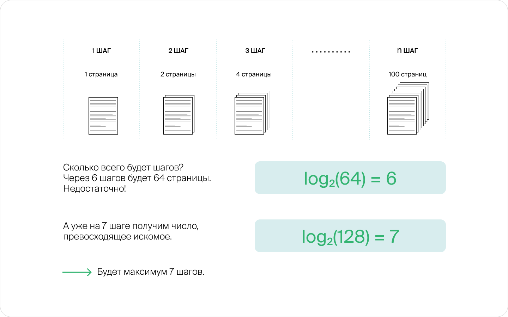
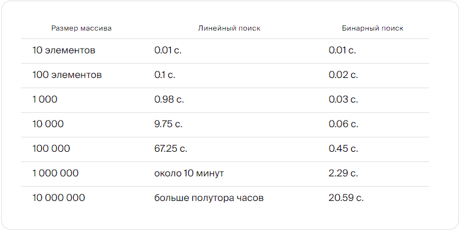

# Бинарный поиск

Есть и другой способ решить задачу поиска элемента в массиве. Если элементы в массиве упорядочены по возрастанию, то найти нужный можно гораздо быстрее.

Представьте, что ищете слово «мультифора» в словаре. Вряд ли вы станете листать страницу за страницей, начиная с первой, — ведь слова отсортированы по алфавиту. Лучше открыть книгу примерно посередине. Если вы попали на страницу с нужным словом, алгоритм завершён. Если же слово находится раньше открытой страницы, вы откроете словарь примерно в середине первой половины, а если после — в середине второй. И так до окончания поиска.

Допустим, мы хотим применить этот алгоритм к словарю из 100 страниц. 
Объём рассматриваемой части книги будет каждый раз уменьшаться вдвое до тех пор, 
пока не останется всего одна страница. Делить словарь из 100 страниц пополам мы 
можем максимум 7 раз. Получается, чтобы найти нужное слово, нам достаточно будет 
просмотреть не более 7 страниц.

А теперь давайте развернём этот алгоритм в обратную сторону. Имея одну страницу, можно за 7 итераций получить 128 (что даже больше 100) страниц, на каждом шаге увеличивая объём вдвое: 2, 4, 8, 16, 32, 64, 128.

На математическом языке говорят, что число 7 является _«логарифмом числа 128 по основанию 2»_.

Определение:
_logb(a)_ — это то, в какую степень нужно возвести число _b_, чтобы получить число _a_.

log2100≈6,64. Но нас интересуют целые числа, так как число просмотров страниц не может быть дробным.

Рассмотренный алгоритм называется _бинарным поиском_. Ещё его называют: _двоичный поиск_, 
_метод деления пополам_, _дихотомия_. Скорость его работы имеет логарифмическую зависимость 
от размера входных данных.

## Линейный vs Бинарный поиск

Мы запустили линейный и бинарный поиск на одинаковых данных. Смотрите, как меняется время работы в зависимости от размера массива, в котором производится поиск.

Современные компьютеры довольно быстры, поэтому, чтобы было видно разницу, на каждом массиве мы запустили не один, а сто тысяч запросов.

Обратите внимание, что на небольших объёмах входных данных разница между линейным и бинарным поиском не такая уж большая. Но чем больше данных на входе — тем сильнее заметна разница.

Именно поэтому работу алгоритмов обычно сравнивают на больших числах, ведь справиться с маленькими — дело нехитрое.