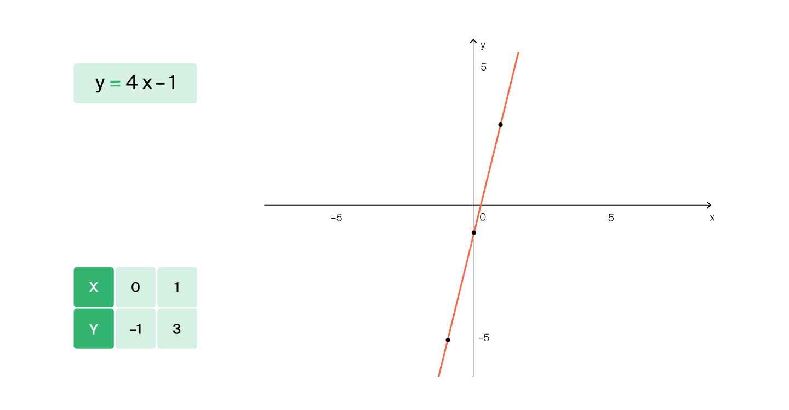

# Линейный поиск

Одна из основных задач при работе с алгоритмами — оценка эффективности программы и поиск наиболее экономичного подхода. Самое простое и поверхностное решение этой задачи — написать программу и замерить время её выполнения. Программа тормозит? Изменить программу, оптимизировав решение.

Но настоящие алгоритмисты так не делают — они не любят зря тратить силы: писать медленные программы, измерять скорость работы и только потом думать, как ускорить решение. Вместо этого они заранее оценивают время работы алгоритма и сразу пишут эффективную программу.

В первом спринте мы расскажем о том, как подходить к решению алгоритмических задач, что такое сложность алгоритма и как правильно тестировать свою программу.

Начнём с оценки эффективности. Допустим, нам нужно найти какой-нибудь элемент в массиве. Давайте рассмотрим один из возможных алгоритмов решения этой задачи и оценим время его работы.

Начнём с алгоритма поиска элемента в массиве и на его примере поговорим о том, как оценивают время работы алгоритма.

#### Постановка задачи: 
Дан массив целых чисел длины _N_. Нужно найти в нём заданное число _x_ и вернуть его индекс. Если
_x_ в массиве не встречается — вернуть ```-1```.

Рассмотрим одно из решений этой задачи:
```js
// Функция для поиска элемента в массиве
function find_element(numbers, x) {
    // Проходим по всем элементам массива
    for (let i = 0; i < numbers.length; i++) {
        // Сравниваем их с иксом
        if (numbers[i] == x) {
            // Если нашли - возвращаем индекс
            return i;
        }
    }
    // Если не нашли - возвращаем -1
    return -1;
}
```

Алгоритм решает поставленную задачу. Но насколько быстро он это делает?

Попробуем понять, сколько элементарных операций совершается в процессе его работы. Под элементарной операцией понимают любую арифметическую операцию или операцию сравнения.

В реализации алгоритма видно, что для каждого элемента массива будет выполнена одна элементарная операция — сравнение с
_x_, увеличение счётчика _i_ и т.д. Осталось понять, сколько элементов будет рассмотрено. Правильный ответ: по-разному, в зависимости от того, какой элемент мы ищем.

В зависимости от значения
_x_ будет рассмотрено разное количество элементов. Однако при оценке скорости работы алгоритма 
обычно оценивают **сложность в худшем случае** (англ. worst-case complexity).

Тогда в худшем случае наш алгоритм рассмотрит _N_ элементов.

Можем сказать, что скорость работы алгоритма в худшем случае пропорциональна размеру 
массива. На математическом языке ещё говорят: **«Вычислительная сложность алгоритма 
линейно зависит от размера входных данных»**. 

Разберём эту фразу:

**Вычислительная сложность алгоритма**. Обычно под этой фразой программисты понимают количество элементарных операций, 
которые будут совершены.

**Размер входных данных**. Входные данные — то, что алгоритм получает на вход. В нашей
задаче это массив ```numbers``` и переменная ```x```. Размер входных данных примерно равен ```N```.

**Линейная зависимость**. Описывается формулой _**y=kx+b**_.

Например, если в комнате _x_ табуретов, то количество их ножек можно посчитать по 
формуле _**y=4x**_. То есть количество ножек линейно зависит от количества табуретов.
Если один из табуретов оказался трёхногим, зависимость всё ещё будет линейной: _**y=4x−1**_.



Из-за того, что у описанного алгоритма поиска время работы линейно зависит от размера входных данных, 
он называется _линейным поиском_.

В следующем уроке рассмотрим другой алгоритм поиска и оценим его время работы.